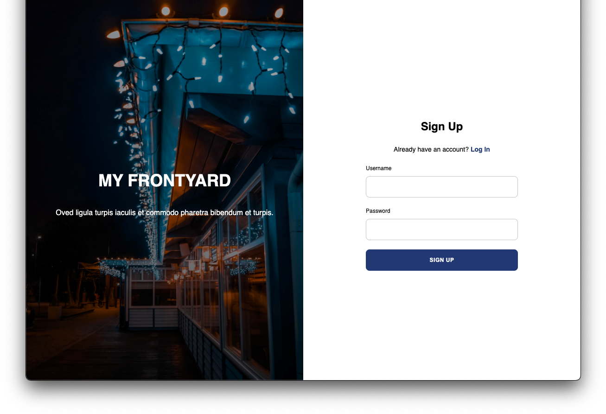

<div id="top"></div>

<div align="center">
  <a href="https://github.com/jonmorg-hs/ProjProp">
    
  </a>
  <h2>My FrontYard</h2>
  <h3>The perfect place to find the events at properties near you!<h3> 
  <br>
  <a href="https://my-frontyard.herokuapp.com/login">See the Project!</a>
</div>

<details>
  <summary>Table of Contents</summary>
  <ol>
    <li>
      <a href="#about-the-project">About The Project</a>
      <ul>
        <li><a href="#built-with">Built With</a></li>
      </ul>
    </li>
    <li><a href="#user-stories">User Stories</a></li>
    <li><a href="#contributors">Contacts</a></li>
    <li><a href="#proj-func">Project Functionality</a></li>
    <li><a href="#project-links">Project Links</a></li>
    <li><a href="#installation">Installation</a></li>
    <li><a href="#contrib">Contributions</a></li>
    <li><a href="#license">License</a></li>
  </ol>
</details>

<div id="about-the-project"></div>

## About The Project 

The holiday season is a time for celebration that should be shared with many. Some go above and beyond, creating glamorous christmas displays that deserve to be seen, but not always are. Our team was inspired by this problem to create an app that makes such events easier to find.

Advertising residential events beyond friends and family to the greater public is a problem that does not have a direct solution. That is where My FrontYard comes in.

My FrontYard is an intuitive app designed to allow hosts to advertise their residential events and allows other users to access event information and plan their journey to said events.

These events include:
- Christmas light decorations
- Garage Sales 
- Halloween decorations




<p align="right">(<a href="#top">back to top</a>)</p>

<div id="built-with"></div>

### Built With 

- JavaScript
- CSS
- MySQL 
- Sequelize ORM
- Node.js 
- Express.js 
- Handlebars.js 
- Heroku
- JSON
- Github
- Third Party API's

<p align="right">(<a href="#top">back to top</a>)</p>

<div id="user-stories"></div>

## User Stories 

```
AS A user who wants to locate great christmas decorations in my area

I WANT to instigate a radius based search for properties based on my parameters centred on my location
I WANT to select each search result and see a pop-up containing basic information about the event 
I WANT each pop-up to contain the event time, date, location, user likes and a picture of the property 

SO I can find relevent properties in my area displaying christmas decorations
```

```
AS A user who wishes to advertise their property for a garage sale

I WANT to list the location of my event
I WANT to add a short description about my event
I WANT to specify the time and date of my event
I WANT to display a picture of my property

SO THAT potential customers may come to my event
```

```
AS A user that has seen multiple great christmas decorations 

I WANT to 'like' outstanding properties 
I WANT to favourite these properties
I WANT to view my liked and favourited properties from my account page

SO THAT other users may better see outstanding properties and I can view them in the future
```

```
AS A user who wants their information secure

I WANT to be promted to sign up the first time I enter the site
I WANT to save my information, including event details, my name, my address and my favourites
I WANT to delete my personal information if I so wish
I WANT to logout when my session is finished

SO THAT my personal information is secure and my data and preferences are saved
```
<p align="right">(<a href="#top">back to top</a>)</p>

<div id="contributors"></div>

## Contacts: 

- Jon - https://github.com/jonmorg-hs ·
- Van - https://github.com/vanjungthawng ·
- Chaitra - https://github.com/chaitra-srinivas ·
- Brent - https://github.com/Brent-RM · morris.rs.brent@gmail.com

<p align="right">(<a href="#top">back to top</a>)</p>

<div id="proj-func"></div>

## Project Functionality 

My FrontYard features:
1. A complete app with login credentials.
2. The ability to register your property for an event of your choosing and remove the event from public view if you wish.
3. The ability for other users to make a radius based search to find the events they are interested in in their area.
4. The ability to like and favourite particular events and view them from a favourites page.
5. An interactive map with events tailored to the user.

The Following video deomonstrates the project funtionality: 


<p align="right">(<a href="#top">back to top</a>)</p>

<div id="project-links"></div>

## Project Links 

Project Link: https://github.com/jonmorg-hs/ProjProp

Heroku Deployment: https://my-frontyard.herokuapp.com/login

<p align="right">(<a href="#top">back to top</a>)</p>

<div id="installation"></div>

### Installation

To get a local copy up and running please follow these steps.

1. Clone the repo
   ```sh
   git clone https://github.com/jonmorg-hs/ProjProp.git
   ```
2. Install NPM packages
   ```sh
   npm install
   ```
3. Run on local server
   ```sh
   npm server.js
   ```

<p align="right">(<a href="#top">back to top</a>)</p>

<div id="contrib"></div>

## Contributing

If you have a suggestion that would make this better, please fork the repo and create a pull request.

Don't forget to give the project a star! Thanks again!

1. Fork the Project
2. Create your Feature Branch (`git checkout -b Feature`)
3. Commit your Changes (`git commit -m 'This is the new feature'`)
4. Push to the Branch (`git push origin Feature`)
5. Open a Pull Request

<p align="right">(<a href="#top">back to top</a>)</p>

<div id="licence"></div>

## License
Distributed under the MIT License. See `LICENCE.txt` for more information.

<p align="right">(<a href="#top">back to top</a>)</p>